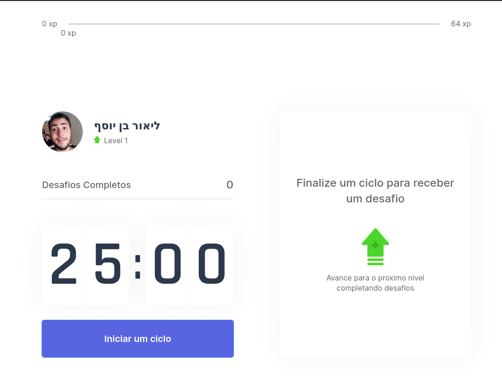

# [MoveIT](https://moveit-lfwxit6xp-librity.vercel.app/)

Gamified office workout app for IT professionals.

- [Production App](https://moveit-lfwxit6xp-librity.vercel.app/)
- [Figma](https://www.figma.com/file/2dUsNg85gVEmVIe4Y0UFCX/RS-NLW-Move.it-1.0?node-id=160%3A2761)

<p align="center">
  
</p>

## Getting Started

First, clone this repo and run the development server:

```bash
npm run dev
# or
yarn dev
```

Open [http://localhost:3000](http://localhost:3000) with your browser to see the result.

## Documentation

- [React.js Documentation](https://reactjs.org/docs/getting-started.html)
- [Next.js Documentation](https://nextjs.org/docs) - learn about Next.js features and API.
- [Learn Next.js](https://nextjs.org/learn) - an interactive Next.js tutorial.
- [Vercel deployment documentation](https://nextjs.org/docs/deployment)
- [JavaScript Cookie Documentation](https://github.com/js-cookie/js-cookie)
